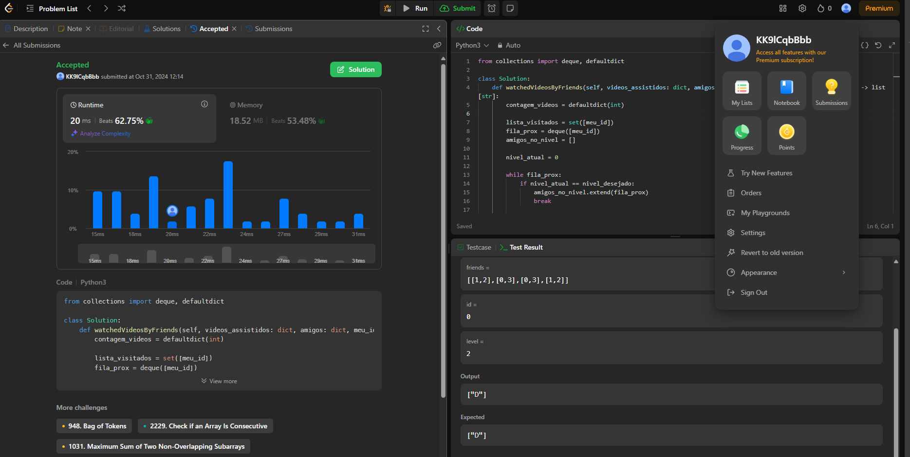

# Exercício do Juiz Online LeetCode

**Número da Lista**: 49 
**Conteúdo da Disciplina**: Grafos 1 

## Alunos
|Matrícula | Aluno |
| -- | -- |
| 17/0008291  |  Cristian Furtado |
| xx/xxxxxx  |  xxxx xxxx xxxxx |

## Sobre 
Serão realizados 3 exercícios na plataforma no LeetCode que são:

- <a href="https://leetcode.com/problems/get-watched-videos-by-your-friends/">Veja quais vídeos foram assistidos pelos seus amigos (Médio)</a>
- <a href="https://leetcode.com/problems/second-minimum-time-to-reach-destination/description/">Segundo tempo mínimo para se chegar ao destino (Difícil)</a>
- <a href="https://leetcode.com/problems/number-of-provinces/description/">Número de províncias (Médio)</a>

## Screenshots

## Instalação 
**Linguagem**: Python 3.10.* 

Necessário ter instalado na máquina versão do Python 3.10.* para que sejam executados os exercícios e uma conta no site LeetCode.

## Uso 
Explique como usar seu projeto caso haja algum passo a passo após o comando de execução.

## Outros 
Quaisquer outras informações sobre seu projeto podem ser descritas abaixo.

## Link do vídeo com explicação 

